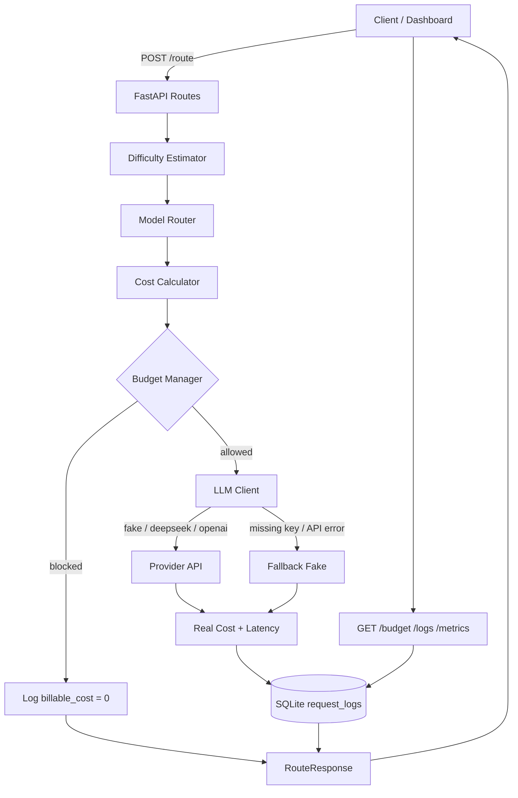

# Model Router with Budgets

A **cost-aware LLM routing layer** built with FastAPI. Before every model call, the system estimates prompt difficulty, selects an appropriate model tier, checks a monthly spend budget, then either invokes the LLM or blocks the request — with full request logging, latency tracking, and a live dashboard.

Most AI apps treat every prompt the same: send it to the strongest model available and hope the bill stays manageable. That works for a demo. In production, it burns money. **Model Router with Budgets** sits in front of your providers and makes the decision you actually need: *Is this prompt hard enough to justify an expensive model — and do we still have budget left?*

This project is designed as a portfolio-ready demonstration of production LLM systems thinking: routing, cost estimation, budget enforcement, observability, and graceful fallback.

---

## Why Budget-Aware Routing Matters

Production LLM systems fail quietly when cost is an afterthought:

- Simple prompts get routed to premium models, driving up unit cost for no gain
- Traffic spikes can exhaust monthly spend before anyone notices
- Provider outages leave users with empty errors instead of a degraded-but-working path
- Without request-level logging, you cannot answer *why* costs spiked last Tuesday

A model router turns those problems into policy: **estimate → select → check budget → call (or block) → log**. Budget tracking is not a spreadsheet concern — it is a runtime gate that protects the business before the API invoice does.

---

## Key Features

| Feature | What it does |
| --- | --- |
| **Heuristic difficulty estimation** | Scores prompts into `easy` / `medium` / `hard` with human-readable reasons |
| **Dynamic model selection** | Maps difficulty → tier → model across Fake, DeepSeek, and OpenAI |
| **Pre-call cost estimation** | Estimates token usage and USD cost before hitting a paid API |
| **Monthly budget gate** | Blocks requests when estimated cost would exceed remaining monthly budget |
| **Billable vs estimated cost** | Only real provider success paths consume budget (`billable_cost`) |
| **Automatic fallback** | Missing API keys or provider errors degrade to fake mode instead of hard failing |
| **SQLite request history** | Persists prompts, answers, tokens, latency, provider mode, and budget status |
| **Metrics & dashboard** | Live UI plus `/metrics`, `/budget`, and `/logs` for ops-style inspection |
| **Swagger docs** | Interactive OpenAPI at `/docs` |

---

## System Architecture & Routing Flow



**Pipeline in plain language**

1. Receive and validate the prompt  
2. Estimate difficulty (heuristic score + reasons)  
3. Choose provider-aware model tier  
4. Estimate USD cost from token heuristic × model pricing  
5. Check remaining **global monthly** budget  
6. Call the provider if allowed — or block without calling  
7. On key/API failure, fall back to fake mode (`billable_cost = 0`)  
8. Persist the full decision to SQLite and return a structured response  

---

## Model Tiers & Pricing

Pricing is stored in `app/services/cost_calculator.py` as **USD per 1M tokens**. Real-provider rates approximate public list pricing; fake models use illustrative simulated rates for local demos.

### Routing map

| Difficulty | Tier | Fake | DeepSeek | OpenAI |
| --- | --- | --- | --- | --- |
| Easy | cheap | `fake-cheap-model` | `deepseek-chat` | `gpt-4.1-nano` |
| Medium | mid | `fake-mid-model` | `deepseek-chat` | `gpt-4.1-mini` |
| Hard | expert | `fake-expert-model` | `deepseek-reasoner` | `gpt-4.1-mini` |

### Token pricing (USD / 1M tokens)

| Model | Input | Output | Notes |
| --- | ---: | ---: | --- |
| `fake-cheap-model` | $0.05 | $0.10 | Simulated |
| `fake-mid-model` | $0.10 | $0.20 | Simulated |
| `fake-expert-model` | $0.20 | $0.40 | Simulated |
| `deepseek-chat` | $0.27 | $1.10 | Real provider |
| `deepseek-reasoner` | $0.55 | $2.19 | Real provider |
| `gpt-4.1-nano` | $0.10 | $0.40 | Real provider |
| `gpt-4.1-mini` | $0.40 | $1.60 | Real provider |

**Budget semantics today**

- One **global** monthly budget (`MONTHLY_BUDGET`, default `$1.00`)
- Spend = sum of `billable_cost` for the current calendar month (UTC)
- Fake, fallback, and blocked requests do **not** consume budget
- Restart does **not** reset usage — SQLite persists history across runs
- A new calendar month opens a fresh spend window; old logs remain for analytics

---

## Tech Stack

- **Python** + **FastAPI** + **Uvicorn**
- **Pydantic v2** for request/response schemas
- **SQLite** for request logging and budget aggregation
- **OpenAI SDK** for OpenAI and DeepSeek-compatible chat completions
- **HTML / CSS / JS** dashboard served by FastAPI

---

## Quick Start

### 1. Clone and enter the project

```bash
git clone https://github.com/revanthbarik/model-router-budget.git
cd model-router-budget
```

### 2. Create a virtual environment

```bash
python -m venv .venv
source .venv/bin/activate          # Windows: .venv\Scripts\activate
```

### 3. Install dependencies

```bash
pip install -r requirements.txt
```

### 4. Configure environment

```bash
cp .env.example .env
```

Edit `.env`:

| Variable | Example | Purpose |
| --- | --- | --- |
| `LLM_PROVIDER` | `fake` / `deepseek` / `openai` | Active provider |
| `OPENAI_API_KEY` | `sk-...` | Required when `LLM_PROVIDER=openai` |
| `DEEPSEEK_API_KEY` | `...` | Required when `LLM_PROVIDER=deepseek` |
| `MONTHLY_BUDGET` | `1.00` | Global monthly USD budget |
| `MAX_PROMPT_CHARS` | `4000` | Prompt length limit |
| `USE_REAL_LLM` | `false` | Legacy fallback if `LLM_PROVIDER` is unset |

For a zero-config demo, set `LLM_PROVIDER=fake` (or leave real keys empty — the router falls back to fake automatically).

### 5. Run the server

```bash
uvicorn app.main:app --reload
```

| Surface | URL |
| --- | --- |
| Dashboard | http://127.0.0.1:8000/ui |
| API root redirect | http://127.0.0.1:8000/ |
| Swagger docs | http://127.0.0.1:8000/docs |
| Health | `GET /health` |
| Route a prompt | `POST /route` |
| Budget snapshot | `GET /budget` |
| Recent logs | `GET /logs` |
| Aggregated metrics | `GET /metrics` |

### Example request

```bash
curl -X POST http://127.0.0.1:8000/route \
  -H "Content-Type: application/json" \
  -d '{"prompt": "Explain how binary search works with a short example."}'
```

---

## Project Structure

```text
app/
├── main.py                 # FastAPI app, lifespan, static UI mount
├── config.py               # Env loading & provider resolution
├── database.py             # SQLite schema + connection helpers
├── api/routes.py           # /health, /budget, /logs, /metrics, /route
├── schemas/                # Pydantic request/response models
└── services/
    ├── difficulty_estimator.py
    ├── model_router.py
    ├── cost_calculator.py
    ├── budget_manager.py
    ├── llm_client.py
    └── request_logger.py
static/                     # Dashboard UI
tests/                      # Basic unit/API smoke tests
data/model_router.db        # Local SQLite store (gitignored)
```

---

## What I Learned Building This

- How to insert a decision layer *before* an expensive LLM call
- How difficulty estimation, model mapping, and budget gates compose into a pipeline
- How to separate estimated cost from billable cost for honest spend tracking
- How fallbacks improve reliability when keys are missing or providers fail
- How SQLite can provide lightweight observability for demos and prototypes

---

## 🚧 Production Roadmap / Planned Improvements

These are known limitations of the current implementation — intentional starting points for hardening toward production.

### Reliability & correctness
- [ ] **Atomic budget enforcement** — Today’s check-then-call-then-log path has no SQLite transaction/`BEGIN IMMEDIATE`, so concurrent `/route` calls can overspend under load
- [ ] **Post-call spend verification** — Budget is gated on the *estimate* only; actual token usage can exceed remaining budget while still logging `budget_status=allowed`
- [ ] **Stronger token accounting** — Replace the `words × 2` heuristic with a real tokenizer (Tiktoken / provider usage) and wire up the unused `token_counter` stub
- [ ] **Explicit provider failure responses** — Missing keys and API errors currently return HTTP 200 with silent `fallback_fake`; production needs structured errors, retries, and circuit breaking

### Concurrency & performance
- [ ] **Async I/O end-to-end** — Route handlers and OpenAI/DeepSeek calls are synchronous and block workers; move to async clients + `aiosqlite` (or a connection pool)
- [ ] **Reusable HTTP clients** — A new OpenAI client is constructed per request; pool/reuse with explicit timeouts
- [ ] **DB path robustness** — Relative `data/model_router.db` depends on process CWD; resolve against project root or config

### Product & multi-tenancy
- [ ] **Per-user / per-workspace budgets** — Replace the single global monthly budget with scoped quotas and auth
- [ ] **API authentication & rate limiting** — All endpoints are currently open
- [ ] **Configurable pricing & routing tables** — Move hardcoded `MODEL_PRICING` / provider maps to env, YAML, or a control plane
- [ ] **Clearer expert-tier differentiation** — OpenAI hard and medium both map to `gpt-4.1-mini`; DeepSeek easy and medium both use `deepseek-chat`

### Observability & quality
- [ ] **Better schema migrations** — Boot-time `ALTER TABLE` for overlapping columns is fragile; adopt versioned migrations
- [ ] **Richer analytics** — Pagination/filters on logs, dashboards for spend by model/difficulty, alerting at 80% budget
- [ ] **Test isolation** — Expand coverage (budget blocks, cost math, fallbacks); stop writing tests into the live DB; pin `pytest` in `requirements.txt`
- [ ] **UI/server config sync** — Dashboard hardcodes a 4000-char limit instead of reading `MAX_PROMPT_CHARS`

### Ops
- [ ] Docker Compose packaging and a one-command demo
- [ ] Deployed staging environment with secrets management (no committed keys)
- [ ] Clean up orphaned stubs (`request_log` model, unused utils) and stray assets artifacts

---

## License

MIT — feel free to fork, extend, and adapt for your own cost-aware LLM stacks.
```